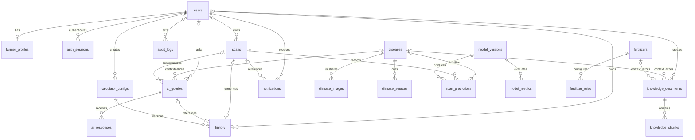

# Database design

Phase 2 implements PostgreSQL persistence with Prisma 7.10.0 and the PostgreSQL driver
adapter. The [Prisma schema](../backend/prisma/schema.prisma) defines the relational
structure; [versioned SQL migrations](../backend/prisma/migrations/) additionally define
checks, partial indexes, and triggers. Read both when changing the database.
Phase 4 adds the required auth session table and authentication API, documented in
[authentication](18-authentication.md). Inference, retrieval, calculator and
notification delivery remain future work.

## Storage conventions

All 20 application tables (19 domain tables plus auth_sessions) have UUID primary keys generated by PostgreSQL and
`created_at TIMESTAMPTZ(6)`. Mutable records also have `updated_at`, maintained by
Prisma and database triggers for SQL writers. Prediction, metric, response, audit,
and history records retain their original creation time and reject payload updates.
SQL names use snake case; Prisma models and fields use PascalCase/camelCase.
Enums represent roles, statuses, severity, knowledge topics, calculator kinds,
dataset splits, query/response kinds, audit actions, notification kinds, and history kinds.

Image/model binaries remain outside PostgreSQL. Image records retain Cloudinary URL
and unique public ID; models retain artifact URI and SHA256. JSONB stores variable
structured parameters, probability distributions, metric arrays, citations, and
calculation snapshots. JSON shape checks are present; future service validators must
validate their full domain contracts and reject secrets in audit changes.

## Tables

| Table / Prisma model | Main data and relations | Uniqueness and important indexes |
|---|---|---|
| `users` / User | Normalized email, password hash, FARMER/ADMIN, lifecycle status | Email; role/status/creation |
| `auth_sessions` / AuthSession | Account, current refresh digest, absolute expiry, irreversible revocation and timestamps | Refresh digest; user/revocation, expiry |
| `farmer_profiles` / FarmerProfile | One farmer account, display name, contact/location, hectares, language, optional avatar | User; avatar public ID |
| `diseases` / Disease | Slug, name, description, symptom/cause/treatment/precaution arrays, stages, severity, status | Slug; status/name |
| `disease_images` / DiseaseImage | Disease, image asset, alternative text, sort order | Cloudinary public ID; disease/order |
| `disease_sources` / DiseaseSource | Disease, title, URL or bibliographic citation, publisher/date/status | Disease/status |
| `scans` / Scan | Optional farmer, image metadata, processing status/duration/error, finish/expiry times | Cloudinary public ID; (ID,user); user/creation, status/creation, expiry |
| `scan_predictions` / ScanPrediction | Scan, model version, optional disease, class, confidence, full probabilities | Scan/model; model/creation, disease/creation |
| `knowledge_documents` / KnowledgeDocument | Stable key/version, text/hash, source, topic/language/status, optional disease/fertilizer/creator | Key/version; one active per key; status/topic/language and foreign keys |
| `knowledge_chunks` / KnowledgeChunk | Document, ordered text/hash, token count, vector, embedding model/dimensions/status | Document/index; embedding status/model |
| `fertilizers` / Fertilizer | Slug/name, description, N/P2O5/K2O percentages, method/precautions/source/status | Slug; status/name |
| `fertilizer_rules` / FertilizerRule | Fertilizer, key/version, growth stage, JSON parameters, unit/source/status | Fertilizer/key/version; one active per fertilizer/key; status/stage |
| `calculator_configs` / CalculatorConfig | FERTILIZER/YIELD, key/version, JSON parameters, unit/source/status, optional creator | Kind/key/version; one active per kind/key; kind/status, creator |
| `model_versions` / ModelVersion | Version, architecture, artifact/hash, dataset/preprocessing versions, ordered labels, training config/status | Version; artifact URI; one production model; status/creation |
| `model_metrics` / ModelMetric | Model, TRAIN/VALIDATION/TEST, dataset/sample count, accuracy/precision/recall/F1/loss, confusion matrix/per-class metrics/learning curves | Model/split/evaluation time |
| `ai_queries` / AiQuery | Optional user/scan/disease context, question, kind/status | (ID,user); user/creation, scan, disease, status/creation |
| `ai_responses` / AiResponse | Query, answer/status, provider model, citations, duration/token counts/error | Query/creation; multiple retained responses per query |
| `audit_logs` / AuditLog | Optional actor, action, polymorphic entity type/UUID, request ID, redacted changes | Actor/creation; entity type/ID/creation |
| `notifications` / Notification | Recipient, optional owned scan, kind, title/message, read time | User/read/creation; scan/user |
| `history` / History | Farmer activity pointing to owned scan/query or exact calculator version; calculation snapshot | Unique scan/query; user/creation, calculator version |

## Relationships

AuthSession belongs to users with ON DELETE CASCADE. It stores only the current
refresh digest, immutable absolute expiry, irreversible revocation and timestamps;
unique digest plus user/revocation and expiry indexes support authentication/cleanup.
The additive fourth migration supplies its time/hash check and two protection/update
triggers; existing domain constraints and migrations are preserved.

Audit entity identifiers deliberately have no polymorphic foreign key so deletion of
the audited entity does not erase its identity. Citations are JSON snapshots rather
than inferred relational links; their contents must include reviewed source/version
identifiers when grounded generation is implemented.

## Integrity and lifecycle

- Emails must already be trimmed and lowercase. The unique index therefore prevents
  case variants without adding a second login identity. Only hashes belong in
  `password_hash`; Phase 4 uses Argon2id and implements authentication/session rotation.
- Farmer profiles, owned scans, and farmer history require FARMER accounts. Referenced
  farmers cannot switch to ADMIN while those records exist.
- Anonymous scans have `user_id = NULL`. Their ownership and original image metadata
  cannot be rewritten. Owned scan/query deletion uses RESTRICT so account deletion
  cannot silently turn historical records into anonymous activity.
- History and scan notifications use composite ownership foreign keys. They cannot
  point to anonymous scans or another farmer's records. Query scan context must have
  the same owner, including NULL for anonymous queries.
- History kinds select exactly one target; calculator history must match the config
  kind. A calculation keeps its exact config ID and a JSON input/result/unit snapshot.
- Image byte count is positive; MIME metadata permits JPEG, PNG, or WebP. Processing
  duration is nonnegative; terminal scans require a finish time and failed scans an
  error code. File decoding, upload limits, and state-transition rules remain service work.
- Model labels are distinct, nonempty, and ordered. Prediction probabilities contain
  exactly these labels, each in [0,1], summing to one within 0.00001. Confidence is in
  [0,1] and matches the predicted class probability within 0.000001.
- Knowledge SHA256 must match UTF-8 content. Source references are required. Changes
  to document text, rule/config parameters, or model artifact/training metadata require
  a new version; status can change. Chunk text is immutable while embeddings can be refreshed.
- Original document/calculator creators cannot be reassigned. Their optional references
  may become NULL for deletion/anonymization, and cannot then be assigned to another account.
- Partial unique indexes allow one ACTIVE document/rule/config per logical key and
  one PRODUCTION model. Retire/archive the previous version before activating its successor
  in the same transaction. Previous predictions and metrics retain their original model.
- Fertilizer label percentages use **N / P2O5 / K2O** with fixed-point decimals, each
  within [0,100]. Do not add an elemental-sum constraint to oxide-equivalent percentages.
  Configuration sources/units are mandatory; no numerical formulas are seeded or executed.
- Metrics have bounded scores and finite nonnegative loss. Responses marked GROUNDED
  require nonempty citations; this only enforces presence, not agricultural accuracy.
- Profile/notification/history deletion follows account cascades; disease images/sources
  follow disease cascades. References to predictions, documents/chunks, metrics, rules,
  query responses, and calculator history restrict deletion. Optional creator/audit
  actor references can become NULL; audit payload remains unchanged.

Database constraints do not provide endpoint authorization or guarantee external
artifacts remain immutable. Later repositories must filter by authenticated identity,
and model storage must use versioned artifact paths/access policies. Deletion remains
possible through deliberate dependency-order retention workflows; update protection
does not implement retention or legal erasure.

## Vector storage

The migration enables `vector` in the `public` schema. `knowledge_chunks.embedding`
is a nullable unbounded vector with recorded model/dimension metadata, represented as
`Unsupported("vector")?` in Prisma. READY requires a vector and matching dimensions;
PENDING/FAILED require no vector. Parameterized SQL or the future Python retrieval
repository will handle vector writes/search; Prisma handles the ordinary chunk fields.
No embedding API, RAG retrieval, vector index, or production dimensions are chosen.

The configured Neon database supports pgvector. The local Compose image includes
pgvector; the Phase 1 native Windows cluster needs the extension installed before
these migrations can run. HNSW/IVFFlat and a distance operator will be selected once
the embedding model, dimension, workload, and recall targets are known.

## Migration and seed workflow

See [database operations](16-database-operations.md) for exact commands, permissions,
rollback-based integration tests, and isolated migration replay. Prisma validation and
schema diff do not inspect every custom SQL invariant; catalog and negative tests
verify checks, triggers, and partial indexes independently.

The typed [seed data](../backend/prisma/seed-data.ts) currently has empty reviewed-data
groups. Upserts preserve existing records and versioned payloads. No administrator
credentials, diseases, agricultural advice, fertilizer rates, model versions, or
provider responses are invented. Domain tests use synthetic data and roll back all
writes; auth integration removes only its newly created synthetic user and sessions.

## Remaining decisions

Disease taxonomy, curated and licensed knowledge, application JSON contracts,
calculator equations and units, scan retention/deletion of Cloudinary assets,
embedding model/dimensions/indexes, and model artifacts are later-phase inputs.
No later phase starts automatically.
Established choices are recorded in [engineering decisions](DECISIONS.md).

References: [Prisma 7 configuration and driver adapters](https://docs.prisma.io/docs/guides/upgrade-prisma-orm/v7),
[custom migrations](https://docs.prisma.io/docs/orm/migrations/editing-a-migration),
[PostgreSQL constraints](https://www.postgresql.org/docs/18/ddl-constraints.html),
[pgvector storage, indexes, and container tags](https://github.com/pgvector/pgvector).
