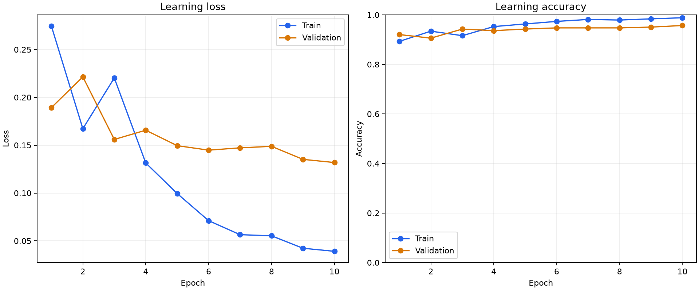
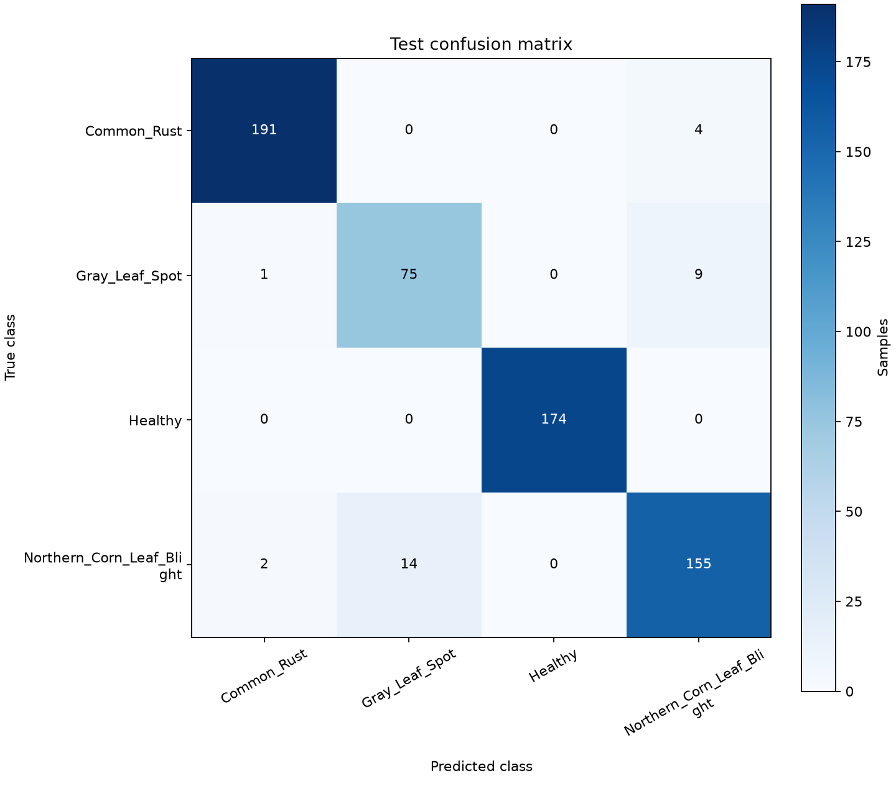

# Phase 10 — ML training and evaluation

Final documentation review: 2026-10-08 (Asia/Karachi).

Phase 10 is explicitly authorized following the approved Phase 9.5 review. This
document records the implemented research baseline and verified interrupted-budget results.
Inference endpoints, Node orchestration, Flutter results and model promotion are later phases.

## Locked dataset and use policy

The labels remain literal and map deterministically to model outputs:

| Index | Label |
|---:|---|
| 0 | Common_Rust |
| 1 | Gray_Leaf_Spot |
| 2 | Healthy |
| 3 | Northern_Corn_Leaf_Blight |

Exclude all 11 shared-rejected inputs and every member of the three contradictory
label families. Record rejection/family reason codes; never relabel or change raw
images. Collapse content-identical copies. Confirmed near/rotated derivatives share
one partition even when their bytes differ.

Current use is **non-commercial academic/FYP research only**. Preserve source/license
declarations and provenance. Never redistribute raw images through Git, reports,
model artifacts or the application. This establishes no commercial clearance;
appropriate licensing or source replacement is required before commercial use.
See [research policy](../ml-training/configs/research-policy.json) and the
[real-image review](24-dataset-intake-preprocessing-review.md).

## Dataset identity and partitions

`configuration.load_dataset_path()` reads existing `DATASET_PATH` configuration.
The local absolute directory is never embedded in source or committed metadata.
`dataset_preparation.py` verifies current bytes against the hash-pinned review,
applies approved eligibility rules, groups verified original identities/derivatives,
then persists versioned eligibility/exclusion/class/split/provenance manifests and
integrity hashes in a new ignored directory. Consumers verify manifests/source identity.

The complete approved metadata index is also persisted in version control at
`ml-training/manifests/maize-research-20261007-v1/manifest.json`, with a compact count/hash
summary. It contains no raw images/private paths; future experiments use this exact
manifest even when local review caches are unavailable.

Seed **20261007** and grouped stratified **70/15/15** train/validation/test allocation
are fixed. Counts can differ slightly from ratios because whole groups stay together.
Each eligible content appears once; content/group intersections across partitions
must be empty. Future experiments reuse these partitions instead of reshuffling for scores.

Dataset version: **maize-research-20261007-v1**. Semantic fingerprint:
`e1abe6c4bba09080371345365ab92067f1f08bfba9f927f66cbc9e58af6b5e98`.
The 8,040 source files contain 4,186 distinct byte contents. Exclusions remove 18
filenames/16 contents (11 invalid inputs plus seven contradictory-family members),
and 3,852 duplicate aliases are collapsed. The result is **4,170 eligible unique
samples in 4,161 content groups**; zero content or group overlaps remain across splits.

| Literal label | Eligible unique | Train | Validation | Test |
|---|---:|---:|---:|---:|
| Common_Rust | 1,301 | 910 | 196 | 195 |
| Gray_Leaf_Spot | 568 | 397 | 86 | 85 |
| Healthy | 1,162 | 813 | 175 | 174 |
| Northern_Corn_Leaf_Blight | 1,139 | 797 | 171 | 171 |
| **Total** | **4,170** | **2,917** | **628** | **625** |

Original-name/UUID evidence establishes image relationships, not independent plants
or fields. Repeated device IDs/timestamps are not invented parent groups. Source
archives overlap; held-out benchmark results do not establish independent field accuracy.

## One preprocessing implementation

Both consumers use `maizedoctor_preprocessing` **1.0.0**. The pinned
[baseline configuration](../ml-training/configs/full-frame-baseline.json) uses disabled
extraction, full-frame RGB, bilinear letterbox to 224×224, and CHW float32 output.
ImageNet mean `[0.485, 0.456, 0.406]` and std `[0.229, 0.224, 0.225]` are configured
in the shared pipeline for pretrained weights. Values are not restricted to [0,1].

Fingerprint: `b142e59f458d27a2d3fddbfc86c2f2f802670ab4909f1275babbef92de9cb5c8`.

No torchvision center crop, duplicate resize/normalization or second production
preprocessing implementation exists. Future serving loads the artifact's exact
configuration/version/hash; generic package defaults remain unchanged.
Mild flips/small affine transforms are explicit **training-only augmentation** after
shared preparation, with normalized background fill. Validation/test have no augmentation.

## Baseline and selection

The baseline is pretrained **MobileNetV3 Small** with four classifier outputs. Its
[Torchvision documentation](https://docs.pytorch.org/vision/stable/models/generated/torchvision.models.mobilenet_v3_small.html)
records a lightweight architecture and ImageNet normalization. Weights are
`MobileNet_V3_Small_Weights.IMAGENET1K_V1` from the official PyTorch host with hash
verification. Execution uses the existing CPU environment, four Torch threads and
zero DataLoader worker processes on Windows.

Index/split verification precedes a small train/validation smoke. Smoke verifies
finite loss/gradients, output compatibility, checkpoint save/reload and correct
split/augmentation behavior; it never evaluates test. Full training uses head warmup
then fine-tuning, AdamW, dropout/weight decay, validation scheduling and early stopping.
Each improving checkpoint has a distinct epoch filename. Selection uses validation only.

Fixed baseline hyperparameters: batch size 16; two frozen-feature/head warmup epochs
at learning rate 0.001, then up to ten fine-tuning epochs with feature/classifier rates
0.0001/0.0003. AdamW weight decay is 0.0001; dropout is 0.2; cross-entropy is unweighted.
ReduceLROnPlateau monitors validation macro F1 (factor 0.5, patience one), and early
stopping allows three non-improving fine-tuning epochs. Gradient norm is capped at 5
with nonfinite values rejected. Checkpoint selection maximizes validation macro F1,
using lower validation loss only to break an exact tie. Final fitting analysis uses
unaugmented training and validation metrics from the same selected checkpoint.

Evaluate the final test partition after selection. Never use test metrics for
hyperparameters, early stopping, normalization, thresholds or checkpoint selection.
Never report 8,040 files as independent examples.

## Experiment artifacts

Each experiment uses a new directory and explicit ID; previous outputs cannot be
overwritten. Retain dataset/index version/fingerprint, exclusions, fixed splits/class
mapping, shared config/version/hash, seed, architecture/pretrained provenance,
hyperparameters, environment/code identity, best checkpoint, train/validation history,
validation/final-test metrics, confusion matrix and per-class precision/recall/F1.
Save one-vs-rest specificity and ROC-AUC where valid; undefined values have reasons.
Produce standalone loss/accuracy, ROC/confusion plots and evidence-based fitting analysis.

Reports contain numerical/model metadata and plots, not raw photographs. Local image
reviews remain ignored. The model is a research artifact, not a production promotion.

## Local commands

Run from the repository root with the existing configured training environment:

```powershell
powershell -NoProfile -ExecutionPolicy Bypass -File scripts/check-development.ps1 -Component Training
ml-training/.venv/Scripts/python.exe ml-training/dataset_preparation.py --output .cache/phase10/datasets/maize-research-20261007-v1
ml-training/.venv/Scripts/python.exe ml-training/train.py --manifest ml-training/manifests/maize-research-20261007-v1/manifest.json --output .cache/phase10/experiments/smoke-20261007-01 --smoke
ml-training/.venv/Scripts/python.exe ml-training/train.py --manifest ml-training/manifests/maize-research-20261007-v1/manifest.json --output .cache/phase10/experiments/mobilenet-v3-small-20261007-01
```

Preparation/smoke/full destinations must not already exist. The preparation command
is for initial creation; subsequent experiments reuse its manifest. Choose a new
experiment ID/output directory for every new run. The dataset always comes from
`DATASET_PATH`, never a positional machine-specific dataset argument.

For a future authorized long run, launch independently of the interactive tool
terminal and redirect logs. Choose a new ID and never replace prior outputs:

```powershell
$phase10Python = (Resolve-Path 'ml-training/.venv/Scripts/python.exe').Path
Start-Process -FilePath $phase10Python -ArgumentList @('ml-training/train.py', '--manifest', 'ml-training/manifests/maize-research-20261007-v1/manifest.json', '--output', '.cache/phase10/experiments/new-experiment-id') -WorkingDirectory (Get-Location).Path -WindowStyle Hidden -RedirectStandardOutput '.cache/phase10/new-experiment-id.stdout.log' -RedirectStandardError '.cache/phase10/new-experiment-id.stderr.log' -PassThru
```

## Interrupted execution and immutable recovery

The original training experiment **mobilenet-v3-small-20261007-01** was externally
interrupted during epoch 11 after **ten fully completed epochs: two warmup and eight
fine-tune**, out of a planned maximum twelve. No final test was evaluated by that
process. This is not an early-stopping or convergence claim. Optimizer/RNG state
was not saved, so no exact training resume is claimed.

The original directory, history and all checkpoints are preserved byte-for-byte.
Separate evaluation recovery **mobilenet-v3-small-20261007-01-recovery** selects
epoch 10 from the ten completed history rows using the unchanged validation macro
F1/loss ordering, verifies metadata/source hashes and independently restores its
unchanged model state. Selection is locked before final test access. It performs
deterministic unaugmented training/validation evaluation and one held-out test
evaluation, without additional fitting, threshold changes or test-based tuning.
This is a valid **ten-epoch, interrupted-budget research baseline**, not completed
twelve-epoch optimization. `recovery.json` binds parent artifacts and evaluator source;
`selection-lock.json` records the pre-test decision. The archived evaluator is review
material, not a new production operation.

## Verification and results

Training checks pass: Ruff format/lint over 19 files, strict mypy over nine source
files, **92 tests**, compatible locked dependencies, repository/template/ignore checks,
local documentation links and private-path/credential checks. Official base weights
match full SHA-256 `047dcff4addef86ea5bc2eff13c9614dc11f47ab1160d0a71a25e7db994f4e1f`
before restricted deserialization. **12 cross-environment synthetic parity cases**,
including the pinned baseline, and **16 real train-image parity cases** pass.
Preparation and independent revalidation confirm all 8,040 raw source hashes unchanged.

Smoke experiment **smoke-20261007-01** passed in 34.42 seconds of model execution:
one epoch, 32 training/16 validation examples, finite loss/gradients, four-output
shape checks, immutable checkpoint save and exact outputs after independent reload.
`test_evaluated_once` is false and test metrics are null. Its small-sample metrics
are infrastructure evidence, not a performance estimate. The original full run used
unchanged baseline settings; its external interruption and separate evaluation
recovery are recorded above. See [PROJECT_STATE.md](PROJECT_STATE.md).

## Final baseline results

Evaluation recovery is complete and independently audited. Selected checkpoint:
**epoch 10**, SHA-256
`a7a08eb88510fd8f58c7a30f174935bf9d6a7bfe941a0eec876ff01d32154c6d`.
Validation metrics after strict reload exactly match the original epoch record.
The final test partition was evaluated **once**, after selection; no subsequent
optimization or threshold tuning occurred.

| Selected-checkpoint evaluation | Unique contents | Accuracy | Macro F1 |
|---|---:|---:|---:|
| Train, unaugmented | 2,917 | 99.5886% | 0.9948 |
| Validation, unaugmented | 628 | 95.7006% | 0.9411 |
| Final test, unaugmented | 625 | **95.2000%** | **0.9396** |

Test macro precision/recall are **0.9375/0.9421**; weighted precision/recall/F1 are
**0.9526/0.9520/0.9522**. Macro/weighted one-vs-rest ROC-AUC are **0.9946/0.9957**.
All four positive/negative class supports are present, so these AUCs are defined.

| Literal test label | Support | Precision | Recall | F1 | Specificity (OVR) | ROC-AUC (OVR) |
|---|---:|---:|---:|---:|---:|---:|
| Common_Rust | 195 | 0.9845 | 0.9795 | 0.9820 | 0.9930 | 0.9990 |
| Gray_Leaf_Spot | 85 | 0.8427 | 0.8824 | 0.8621 | 0.9741 | 0.9877 |
| Healthy | 174 | 1.0000 | 1.0000 | 1.0000 | 1.0000 | 1.0000 |
| Northern_Corn_Leaf_Blight | 171 | 0.9226 | 0.9064 | 0.9145 | 0.9714 | 0.9916 |

**595/625** predictions are correct. Rows are true labels and columns predictions,
in the fixed index order:

```text
[[191,  0,   0,   4],
 [  1, 75,   0,   9],
 [  0,  0, 174,   0],
 [  2, 14,   0, 155]]
```

Twenty-three of the thirty test errors are Gray_Leaf_Spot/Northern_Corn_Leaf_Blight
confusions. This is a reported limitation, not evidence used to retune the tested model.
Perfect Healthy scores apply to these 174 held-out benchmark contents only.

Selected-model training accuracy exceeds validation by **3.8880 percentage points**,
and macro F1 by **0.0537**. This is an overfitting/generalization signal to investigate,
not proof from a gap alone. Both training and validation losses decreased overall;
no final loss divergence is established. Learning exceeds the approximately 31.2%
majority references; underfitting is not established. External interruption prevents
any completed-budget/convergence claim. Unknown plant/field/session identities,
unconfirmed relatives, background/source/watermark bias, and full-frame resize of tiny
lesions limit interpretation. Independent field performance is not established.

The independent auditor recomputed confusion/precision/recall/F1/specificity and
tied-rank AUC directly from saved CSVs, checked exact split membership, selection
and metadata/file hashes, and restored two models on zeros only. It performed no
additional test-image inference. All 24 exported files match their integrity hashes.
Post-training verification checks **all 8,040 original names/bytes/sizes/mtimes unchanged**,
the original training artifacts unchanged, and zero content/group leakage.
The metadata-only [independent artifact audit](../ml-training/reports/verification/mobilenet-v3-small-20261007-01-recovery.audit.json)
and [post-training source proof](../ml-training/reports/verification/maize-research-20261007-v1.post-training-integrity.json)
are preserved separately from the immutable experiment report.
Scoped `.gitattributes` disables newline conversion for frozen manifests/reports
and retains LF for fingerprinted training sources. A Git-index check verifies all
34 manifest/report/source hashes before commit, preventing Windows checkout/staging
conversion from invalidating the recorded identities. This changes no image or model.

## Saved artifacts and environment

The [immutable aggregate report](../ml-training/reports/mobilenet-v3-small-20261007-01-recovery/README.md)
contains summary, history, environment, hyperparameters, selected/validation/test/per-class
metrics, fitting analysis, class mapping, shared configuration, recovery/selection
provenance and standalone plots. It contains no raw photographs or model binaries.
Full local experiment and CSV predictions remain at
`.cache/phase10/experiments/mobilenet-v3-small-20261007-01-recovery/`; the best model is
`checkpoints/epoch-010.pt`. Preserve this directory together with the original run.

Execution used Python **3.11.0**, PyTorch **2.10.0+cpu**, torchvision **0.25.0+cpu**,
four Torch threads on the existing four-core/eight-logical-thread CPU, batch 16 and
no CUDA. The locked environment has 43 compatible installed distributions; Matplotlib
3.11.2 creates numerical plots. Environment records the pre-commit Git revision/dirty
status and exact hashes of all nine training sources. The final Git change retains
those same source bytes. Recovery evaluation took **94.70 seconds**, excluding the
original training; it is not a total training-time claim.





Stop after Phase 10. Model serving/promotion, Node orchestration and Flutter result
workflows remain separately authorized future work.
